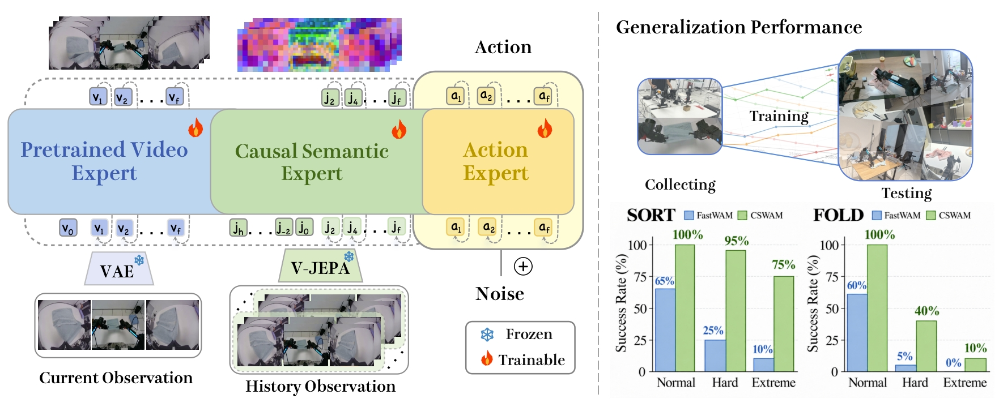

<div align="center">

# CSWAM: Better Causal Semantic Representations for Out-of-Distribution Generalization in World Action Models

Tianbin Liu, Jian Zhu, Taiyi Su, Jianjun Zhang, Chong Ma, Zitai Huang, Weiyi Lu, and Yi Xu

<a href="https://arxiv.org/abs/2609.18462">
  
</a>
<a href="https://huggingface.co/Midea-AIRC/MideaWAM/tree/main">
  
</a>

</div>

CSWAM (Causal Semantic World Action Model) is designed to improve robot-policy
generalization under **out-of-distribution (OOD) visual shifts**. It augments
[FastWAM](https://github.com/yuantianyuan01/FastWAM) with a causal semantic
expert supervised by frozen [V-JEPA 2.1](https://github.com/facebookresearch/vjepa2)
features and conditioned on sparse observation history. With
[DSWAM](https://arxiv.org/abs/2607.04927) FastWAM-style embodied pretraining,
CSWAM improves RoboTwin 2.0 Clean-to-Randomized OOD success from 10.16% to
45.18% and raises average real-robot OOD success from 27.5% to 70.0%, while
retaining action-only inference.

<p align="center">
  
</p>

## Checkpoints

| Model | Training setting | Interface | Files |
| --- | --- | --- | --- |
| CSWAM-RoboTwin-Full | 2,500 Clean + 25,000 Randomized demonstrations | 14D (`cswam_robotwin_14d.yaml`) | [checkpoint](https://huggingface.co/Midea-AIRC/MideaWAM/blob/main/cswam_robotwin_full/step_079105.pt) / [stats](https://huggingface.co/Midea-AIRC/MideaWAM/blob/main/cswam_robotwin_full/robotwin_stats.json) |
| CSWAM-RoboTwin-Clean | 2,500 Clean demonstrations; DSWAM FastWAM-style pretraining initializes the video/action experts only, while the JEPA expert is not pretrained | 16D model / 14D RoboTwin (`cswam_robotwin_16d.yaml`) | [checkpoint](https://huggingface.co/Midea-AIRC/MideaWAM/blob/main/cswam_robotwin_clean/step_028640.pt) / [stats](https://huggingface.co/Midea-AIRC/MideaWAM/blob/main/cswam_robotwin_clean/robotwin_stats.json) |
| DSWAM-301874 | FastWAM-style embodied pretraining used by CSWAM-RoboTwin-Clean | Separate DSWAM model | [checkpoint](https://huggingface.co/Midea-AIRC/MideaWAM/blob/main/dswam/step_301874.pt) |

## Results

All RoboTwin results use 50 tasks and 100 evaluation rollouts per task. In
**RoboTwin2.0-Full**, one policy is trained on 2,500 Clean and 25,000 Randomized
demonstrations. Both evaluation domains are therefore represented during
training.

| Family | Method | Clean | Randomized | Average |
| --- | --- | ---: | ---: | ---: |
| VLA | X-VLA | 72.8 | 72.8 | 72.8 |
| VLA | π0.5 | 82.7 | 76.8 | 79.8 |
| VLA | ABot-M0 | 86.1 | 85.1 | 85.6 |
| VLA | Qwen-VLA | 86.1 | 87.2 | 86.7 |
| VLA | Galaxea G0.5 | 93.7 | 92.8 | 93.3 |
| VLA | Qwen-RobotManip | 93.7 | 94.0 | 93.9 |
| WAM | Motus | 88.7 | 87.0 | 87.8 |
| WAM | FastWAM | 91.9 | 91.8 | 91.9 |
| WAM | LingBot-VA | 92.9 | 91.6 | 92.2 |
| WAM | ST-WAM | 93.1 | 92.5 | 92.8 |
| WAM | LingBot-VA 2.0 | 93.8 | 93.4 | 93.6 |
| WAM | ABot-M0.5 | 94.0 | 94.2 | 94.1 |
| WAM | **CSWAM** | **94.7** | **94.3** | **94.5** |

**RoboTwin2.0-Clean2Random** is the stricter OOD protocol: models are fine-tuned
only on 2,500 Clean demonstrations and evaluated on Randomized scenes without
adaptation. Embodied PT denotes DSWAM FastWAM-style pretraining on a 5,000-hour
robot corpus; it initializes CSWAM's video and action experts, not its JEPA
expert.

| Method | Embodied PT | Clean | Randomized (OOD) | Average |
| --- | :---: | ---: | ---: | ---: |
| FastWAM | No | 63.68 | 1.82 | 32.75 |
| FastWAM | Yes | 76.68 | 10.16 | 43.42 |
| CSWAM | No | 78.48 | 9.36 | 43.92 |
| **CSWAM** | **Yes** | **84.46** | **45.18** | **64.82** |

On two real-robot tasks and three OOD difficulty levels, CSWAM reaches 70.0%
average success versus 27.5% for FastWAM. Each entry below uses 20 trials.

| Task | Shift level | FastWAM | CSWAM |
| --- | --- | ---: | ---: |
| Sort | Normal | 65 | **100** |
| Sort | Hard | 25 | **95** |
| Sort | Extreme | 10 | **75** |
| Fold | Normal | 60 | **100** |
| Fold | Hard | 5 | **40** |
| Fold | Extreme | 0 | **10** |

See the [paper](https://arxiv.org/pdf/2609.18462) for the complete protocol,
completion-time results, baselines, and ablations.

## Installation

The reference environment uses Python 3.10, CUDA 12.8, PyTorch 2.7.1, and bf16
training. Clone this repository, then run:

```bash
conda create -n cswam python=3.10 -y
conda activate cswam

pip install -U pip
pip install torch==2.7.1+cu128 torchvision==0.22.1+cu128 \
  --extra-index-url https://download.pytorch.org/whl/cu128
pip install -e .
```

The project is released as CSWAM, while the Python distribution and import
package remain `fastwam`. This preserves compatibility with the upstream
FastWAM data pipeline, Wan wrappers, ActionDiT, and MoT implementation.

For RoboTwin evaluation, install
[RoboTwin 2.0](https://github.com/robotwin-Platform/robotwin) in a separate
environment by following its official instructions. The simulator environment
does not need the CSWAM model dependencies.

## Required Models

CSWAM uses the following external components:

| Component | Default reference | Purpose |
| --- | --- | --- |
| Wan2.2 | [`Wan-AI/Wan2.2-TI2V-5B`](https://huggingface.co/Wan-AI/Wan2.2-TI2V-5B) | Video DiT and VAE |
| Wan tokenizer | `Wan-AI/Wan2.1-T2V-1.3B` | Tokenizer and text assets |
| V-JEPA 2.1 | [`facebookresearch/vjepa2`](https://github.com/facebookresearch/vjepa2) | Frozen semantic target encoder |
| V-JEPA checkpoint | `vjepa2_1_vitb_dist_vitG_384.pt` | ViT-B student features |
| ActionDiT initialization | Generated locally or follow [FastWAM](https://github.com/yuantianyuan01/FastWAM) | Initialize ActionDiT from Wan Video DiT |

Set `DIFFSYNTH_MODEL_BASE_PATH` to the local Wan model cache. Set
`vjepa_repo`, `vjepa_ckpt`, and `action_dit_pretrained_path` in the selected
training YAML. Machine-specific model and dataset paths in the provided YAMLs
must be replaced before training.

Generate the ActionDiT initialization with:

```bash
python scripts/preprocess_action_dit_backbone.py \
  --model-config configs/train/cswam_robotwin_16d.yaml \
  --output checkpoints/ActionDiT_linear_interp_Wan22_alphascale_1024hdim.pt \
  --device cuda \
  --dtype bfloat16
```

JEPA-DiT is initialized from the resulting ActionDiT unless
`jepa_dit_pretrained_path` points to a dedicated initialization checkpoint.

## Data Preparation

### Supported Configuration Groups

| Config | Raw data | Model interface | Intended use |
| --- | ---: | ---: | --- |
| `configs/train/cswam_robotwin_14d.yaml` | 14D | 14D | Native RoboTwin training |
| `configs/train/cswam_robotwin_16d.yaml` | 14D | 16D | RoboTwin training from a 16D checkpoint |
| `configs/train/cswam_real_robot_14d.yaml` | 14D | 14D | Native real-robot training |
| `configs/train/cswam_real_robot_16d.yaml` | 14D | 16D | Real-robot training from a 16D checkpoint |

The release uses LeRobot-style datasets. Update the dataset directories,
camera keys, action/state fields, and local model paths in the selected YAML.
The checked-in RoboTwin data template is `configs/data/robotwin.yaml`.

### Normalization Statistics

Edit `configs/data/robotwin.yaml` so its dataset paths match the training YAML,
then run:

```bash
OUTPUT=./runs/robotwin_stats.json \
NUM_WORKERS=16 \
  bash scripts/precompute_stats.sh
```

Set `data.train.pretrained_norm_stats` in the training configuration to the
generated JSON file.

### Text Embedding Cache

Training configurations set `load_text_encoder: false`, so text embeddings
must be precomputed. The cache key includes the exact prompt; use the same task
text during preprocessing and training.

```bash
DIFFSYNTH_MODEL_BASE_PATH=/path/to/wan_model_cache \
CACHE_DIR=/path/to/text_embeds_cache \
NPROC_PER_NODE=2 \
  bash scripts/precompute_text.sh
```

Set `data.train.text_embedding_cache_dir` to the generated directory. The text
entrypoint supports LeRobot v2.1 `tasks.jsonl`, LeRobot v3 `tasks.parquet`, and
the episode-segment task annotations used by this repository.

## Training

The launcher defaults to raw 14D RoboTwin data with a 16D model interface. Its
main settings are grouped near the top of `scripts/train_cswam.sh` and may also
be overridden with environment variables.

### Single Node

```bash
DIFFSYNTH_MODEL_BASE_PATH=/path/to/wan_model_cache \
CONFIG=configs/train/cswam_robotwin_16d.yaml \
OUTPUT_DIR=./runs/cswam_robotwin_16d \
GPUS_PER_NODE=8 \
  bash scripts/train_cswam.sh
```

### Initialize From Pretrained Weights

The released CSWAM-RoboTwin-Clean model initializes its video and action
experts from the 16D DSWAM checkpoint. The JEPA expert is not loaded from
DSWAM. Start the same FastWAM-style pretrained setup with:

```bash
DIFFSYNTH_MODEL_BASE_PATH=/path/to/wan_model_cache \
CONFIG=configs/train/cswam_robotwin_16d.yaml \
RESUME=/path/to/dswam/step_301874.pt \
OUTPUT_DIR=./runs/cswam_robotwin_clean \
GPUS_PER_NODE=8 \
  bash scripts/train_cswam.sh
```

When `RESUME` points to a `.pt` file, the trainer loads model weights before
DeepSpeed initialization and starts with a fresh optimizer, scheduler, and
training step.

To restore optimizer, scheduler, global step, and dataloader progress as well,
set `RESUME` to a complete training-state directory instead of a `.pt` file.

For native 14D training, set
`CONFIG=configs/train/cswam_robotwin_14d.yaml`. For real-robot training, select
one of the two `cswam_real_robot_*.yaml` files.

### Multi-Node

Run the same command on every node with a unique `NODE_RANK`:

```bash
NNODES=2 \
NODE_RANK=0 \
GPUS_PER_NODE=8 \
MASTER_ADDR=10.0.0.1 \
MASTER_PORT=29604 \
  bash scripts/train_cswam.sh
```

Frequently used overrides include `BATCH_SIZE`, `NUM_WORKERS`,
`LEARNING_RATE`, `WEIGHT_DECAY`, `NUM_EPOCHS`, `MAX_STEPS`,
`GRADIENT_ACCUMULATION_STEPS`, `MIXED_PRECISION`, `MAX_GRAD_NORM`,
`SAVE_EVERY`, `EVAL_EVERY`, `ACCELERATE_CONFIG`, and
`HOST_MEMORY_TRIM_EVERY`.

## RoboTwin Evaluation

### 1. Inspect A Checkpoint

This validates checkpoint metadata, config dimensions, and raw statistics
without loading the large model components:

```bash
python experiments/robotwin/cswam_rpc_server.py \
  --checkpoint /path/to/cswam_checkpoint.pt \
  --config configs/train/cswam_robotwin_16d.yaml \
  --stats /path/to/robotwin_14d_stats.json \
  --inspect-only
```

Use `cswam_robotwin_14d.yaml` for a native 14D checkpoint.

### 2. Start The CSWAM Server

```bash
CSWAM_PYTHON=/path/to/cswam/bin/python \
CSWAM_CONFIG=configs/train/cswam_robotwin_16d.yaml \
CSWAM_DATASET_STATS=/path/to/robotwin_14d_stats.json \
CSWAM_VJEPA_REPO=/path/to/vjepa2 \
CSWAM_VJEPA_CHECKPOINT=/path/to/vjepa2_checkpoint.pt \
CSWAM_INFERENCE_STEPS=10 \
DIFFSYNTH_MODEL_BASE_PATH=/path/to/wan_model_cache \
  bash experiments/robotwin/run_cswam_server.sh /path/to/cswam_checkpoint.pt
```

T5 and the first-frame VAE run on CPU by default to reduce GPU memory pressure.
Use `CSWAM_TEXT_ENCODER_DEVICE`, `CSWAM_VAE_DEVICE_MODE`, `CSWAM_DEVICE`, and
`CSWAM_PORT` to override the defaults.

### 3. Run The Simulator

Open another terminal:

```bash
ROBOTWIN_ROOT=/path/to/RoboTwin \
ROBOTWIN_PYTHON=/path/to/robotwin/bin/python \
MODE=clean \
TASKS=adjust_bottle \
NUM_EPISODES=1 \
REPLAN_STEPS=24 \
  bash experiments/robotwin/eval_cswam_robotwin.sh
```

- `MODE` accepts `clean`, `random`, or `both`.
- `TASKS` accepts comma-separated official task names. If omitted, all 50
  tasks are evaluated sequentially.
- `NUM_EPISODES` defaults to 100 for a full run.
- `RUN_NAME` and `OUTPUT_ROOT` control log locations.
- The model predicts 32 actions from the 33-frame YAML and executes 24 before
  replanning by default.

To reduce simulation overhead, the evaluator requests history observations
only every four control steps and disables the front camera, depth, point
clouds, segmentation, dataset collection, and evaluation video output. Logs
are written to `evaluate_results/cswam/`.

See [experiments/robotwin/README.md](experiments/robotwin/README.md) for the
evaluation contract and additional overrides.

## Acknowledgements

CSWAM is built on [FastWAM](https://github.com/yuantianyuan01/FastWAM) and uses
components from [Wan2.2](https://huggingface.co/Wan-AI/Wan2.2-TI2V-5B),
[V-JEPA 2.1](https://github.com/facebookresearch/vjepa2), and
[RoboTwin 2.0](https://github.com/robotwin-Platform/robotwin). We thank the
authors and maintainers for releasing their code, models, and benchmark assets.
Third-party components remain subject to their respective licenses and terms.

## License

The original code in this repository is released under the [MIT License](LICENSE).
Third-party code and model weights retain their original licenses. Users are
responsible for checking the licenses of Wan, V-JEPA 2.1, RoboTwin, datasets, and
downloaded checkpoints before redistribution or commercial use.

## Citation

If you find CSWAM useful, please cite the paper:

```bibtex
@article{liu2026cswam,
  title   = {{CSWAM}: Better Causal Semantic Representations for
             Out-of-Distribution Generalization in World Action Models},
  author  = {Liu, Tianbin and Zhu, Jian and Su, Taiyi and Zhang, Jianjun and
             Ma, Chong and Huang, Zitai and Lu, Weiyi and Xu, Yi},
  journal = {arXiv preprint arXiv:2609.18462},
  year    = {2026}
}
```

The released Clean checkpoint uses DSWAM's FastWAM-style embodied pretraining.
If you use this initialization or the DSWAM checkpoint, please also cite:

```bibtex
@article{zhu2026dswam,
  title   = {{DSWAM}: A Dual-System World Action Foundation Model for
             Fine-Grained Robot Manipulation},
  author  = {Zhu, Jian and Zhang, Jianjun and Su, Taiyi and Liu, Tianbin and
             Wang, Zhangyuan and Xie, Kai and Huang, Zitai and Ma, Chong and
             He, Youzhang and Wang, Tianjian and Wang, Hanyang and Ding, Weihao
             and Xu, Yi},
  journal = {arXiv preprint arXiv:2607.04927},
  year    = {2026}
}
```
